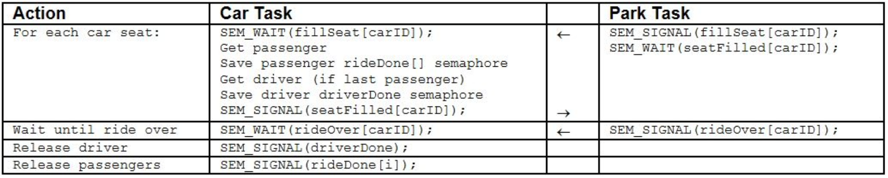
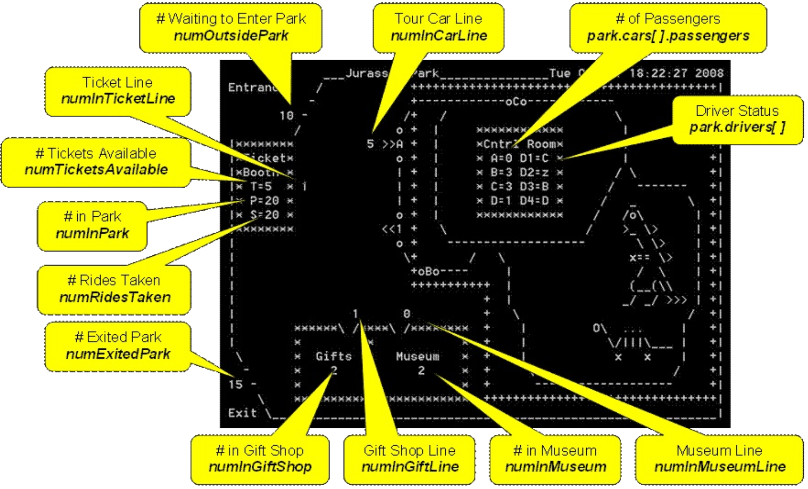

# Introduction

For this lab you will use threads, semaphores, and mutexes to implement a simulation of an ASCII art Jurassic Park!

# Motivation

Contemporary operating systems are built around the concept of processes or tasks. Tasks may or may not be related, may or may not affect the state of another task, but usually always need to share resources in a protected, prioritized, and equitable manner.

Jurassic Park is an inter-process communication and synchronization problem between multiple tasks. Visitors to the park want to first get a ticket, visit the park museum, take a ride on a park tour car to see the dinosaurs, and then visit the gift shop before leaving the park. Since the park is on a limited budget, drivers must perform double duty when not sleeping; selling tickets to the park visitors and driving the tour cars through the park. Visitors, drivers, and cars are represents by concurrent tasks while an additional task is used to display the park status every second.

Attempting to coordinate the park activities without bringing about any race conditions is typical of many queuing problems. A poorly implemented solution could lead to the inter-process communication problems of starvation and deadlock. For example, the driver could end up waiting to sell a ticket to a visitor while a loaded tour car could be waiting for a driver, resulting in deadlock. Alternatively, visitors may not decide to take a tour car ride in an orderly manner, leading to process starvation as some visitors never get the chance for a ride even though they have been waiting in line.

Jurassic Park is not unlike real world simulation and control problems such as found in airports, supply houses, traffic systems, oil tank farms, etc. Each requires multitasking roles involving inter-process coordination and communication. Like the classical dining philosophers and sleeping barber problems, the Jurassic Park exercise demonstrates what problems can occur in a multitasking, multi-user environment when many tasks are competing for the same resources.

# Project Description

Visitors arrive at the Jurassic Park at random times over a  period  of 60 seconds. (Only 20 visitors may be in the park at any one time - OSHA requirements!) Upon entering the park, a visitor gets in line to purchase a ticket. After obtaining a ticket from a driver, the visitor gets in the museum line. (Again, a limited number of visitors are allowed in the museum as well as the gift shop.) After visiting the museum, the visitor gets in the tour car line to wait until invited to board a tour car. As a visitor boards a tour car, he returns his ticket. When the touring car is filled with visitors (3) and a driver, the car enters Jurassic Park and follows a guided tour path through the park. When the tour car completes the ride and pulls into the unloading station, the visitors debark and move to the gift shop line, the driver goes back to sleep awaiting new duties, and the tour car pulls forward to be loaded again. After visiting the gift shop, the visitor exits the park.

# Requirments

The following are important guidelines for completing the Jurassic Park assignment:

1. 60 visitors must pass successfully thru the park.
Add a delta clock to your operating system.
2. Create 3 thread routines (visitor, driver, car) and a thread for each park visitor (NUM_VISITORS), driver (NUM_DRIVERS), and tour car (NUM_CARS) running thosse routines.
3. Update the park data structure variables appropriately as visitor, driver, and car states change. The park is displayed using the park data struct every second by the jurassicTask task in park.c.
4. Visitors should stand in lines for a random time before requesting a ticket, entrance to the museum or gift shop, or getting into a tour car (1-3 seconds).
5. Use resource semaphores (counting) to control access to the park, the number of tickets available, and the number of people allowed in the gift shop and museum.
6. Use mutex semaphores (binary) to protect any critical sections of code within your implementation, such as when acquiring a driver to buy a ticket or drive a tour car, accessing global data, or sampling the state of a semaphore.
7. Use semaphores (binary) to synchronize and communicate events between tasks, such as to awaken a driver, signal data is valid, signal a mode change, etc.
8. Use at least two sem_trywait(...) functions in your simulation.
9. Park critical code must be protected by the parkMutex mutex.
10. The park simulation also creates a "lostVisitor" task which sums critical variables in the park to detect any lost visitors. Beware!
11. You are to implement a fair algorithm that prevents deadlock and starvation rather than detect them.

# Some IPC ideas may or may not want to use

Inter-Process Communication (IPC) refers to the exchange of data among two or more threads in one or more processes. Among others, IPC techniques involve synchronization (events and semaphores), shared memory (globals), message passing (pipes and message queues), sockets, and remote procedure calls (RPC). The method of IPC used may vary based on the bandwidth and latency of communication between the threads, and the type of data being communicated. For Jurassic Park, use semaphores and shared memory as follows:

Semaphores are considered events and are usually one of the following types:

1. **Resource semaphores**. Typically counting, these semaphores are used to control access to the park, the number of tickets available, and the number of people allowed in the gift shop and museum.
```c
//global variables
sem_t tickets;

//some local thread routine
{
// create MAX_TICKETS tickets using counting semaphore
sem_init(&tickets, 0, MAX_TICKETS);

// buy a ticket (consume)
sem_wait(tickets);

// resell ticket (produce)
sem_post(tickets);
}
```

2. **Mutex semaphores**. Typically binary, these semaphores are used to protect critical sections of code within your implementation, such as when updating the delta clock, acquiring a driver to buy a ticket or drive a tour car, accessing global data, or sampling the state of a semaphore.
```c
// need ticket, wait for driver (mutex)
pthread_mutex_lock(&needDriverMutex);
{
	// signal need ticket (signal, put hand up)
}
pthread_mutex_unlock(&needDriverMutex);
// release driver (mutex)
```

3. **Signal semaphores**. Typically binary, these semaphores are used to synchronize and communicate events between tasks, such as to awaken a driver, signal data is valid, signal a mode change, etc. For example, the following code signals the need for a ticket (needTicket), signals a driver to wakeup (wakeupDriver), waits for a ticket to be printed (ticketReady), and then signals to buy the ticket (buyTicket). The task indicates it no longer needs a ticket by consuming the needTicket semaphore.
```c
// only 1 visitor at a time requests a ticket
pthread_mutex_lock(&getTicketMutex);
{
	// signal need ticket (produce, put hand up)
	sem_post(&needTicket);

	// wakeup a driver (produce)
	sem_post(&wakeupDriver);

	// wait for driver to obtain ticket (consume)
	sem_wait(&ticketReady);

	// put hand down (consume, driver awake, ticket ready)
	sem_wait(&needTicket);

	// buy ticket (produce, signal driver ticket taken)
	sem_post(&buyTicket);
}
// done (produce)
pthread_mutex_unlock(&getTicketMutex);
```

4. Shared memory can be implemented using C global memory when protected with mutex semaphores.
```c
randomWait(60);
pthread_mutex_lock(&parkMutex);
myPark.numOutsidePark++;
pthread_mutex_unlock(&parkMutex);
```
or
```c
/*Visitor Task Example*/
sem_t mySemaphore;

//...

// pass semaphore to car (1 at a time)
pthread_mutex_lock(&mailboxMutex); // wait for mailbox
sem_wait(&needPassenger); // wait for passenger request
gMailbox = &mySemaphore; // put semaphore in mailbox
sem_post(&mailboxReady); // raise the mailbox flag
sem_wait(&mailAcquired); // wait for delivery
pthread_mutex_unlock(&mailboxMutex); // release mailbox

/*Car Task Example*/
sem_t* passengerSems[3];

//...

// get passenger semaphore
sem_post(&needPassenger);
sem_wait(&mailboxReady); // wait for mail
passengerSems[i] = gMailbox; // get mail
sem_post(&mailAcquired); // put flag down
```

# Interfacing with "jurassicTask"

The jurassicTask task fills tour cars with passengers when a car is in the loading position, moves tour cars one position forward (if possible) around the park, randomly chooses a route at the route cross roads, and displays the status of Jurassic Park every second. The display is generated from the following C struct variables defined in the **park.h** file:

```c
typedef struct
{
	int numOutsidePark;       // # outside of park
	int numInPark;            // # in park (P=#)
	int numTicketsAvailable;  // # left to sell (T=#)
	int numRidesTaken;        // # of tour rides taken (S=#)
	int numExitedPark;        // # who have exited the park
	int numInTicketLine;      // # in ticket line
	int numInMuseumLine;      // # in museum line
	int numInMuseum;          // # in museum
	int numInCarLine;         // # in tour car line
	int numInCars;            // # in tour cars
	int numInGiftLine;        // # in gift shop line
	int numInGiftShop;        // # in gift shop
	int drivers[NUM_DRIVERS]; // driver state (-1=T, 0=z, 1=A, 2=B, etc.)
	CAR cars[NUM_CARS];       // cars in park
} JPARK;
```

Your visitor, driver, and tour car tasks need to update the appropriate variables at the appropriate times. The following global signal semaphores are defined in **park.c**:

```c
pthread_mutex_t fillSeat[NUM_CARS];   // (signal) seat ready to fill
pthread_mutex_t seatFilled[NUM_CARS]; // (wait) passenger seated
pthread_mutex_t rideOver[NUM_CARS];   // (signal) ride over
```

All car tasks should

1. for each car (and seat in the car),
	- wait (fillSeat) to be filled, seat by seat, when the car is in loading position,
	- get a passenger from the tour car waiting line,
	- get a driver for car (if last seat)
	- signal (seatFilled) that seat has been filled,
2. wait for a signal (rideOver) that the ride is over,
3. and release passenger and driver (allow driver to go back to sleep.)

For example, to fill a seat in tour car carID, wait for available seat ready (fillSeat[carID]), then find a visitor from the tour car waiting line, and then signal (seatFilled[carID]) that you are ready for the next seat. (Communication with the park is indicated by /\*...\*/.)

```c
pthread_mutex_lock(&fillSeat[carID]);	/*wait for available seat*/

sem_post(&getPassenger);	// signal for visitor
sem_wait(&seatTaken);	// wait for visitor to reply

//... save passenger ride over semaphore ...

sem_post(&passengerSeated);	// signal visitor in seat

// if last passenger, get driver
{
	pthread_mutex_lock(&needDriverMutex);

  	// wakeup attendant
  	sem_post(&wakeupDriver);

	//... save driver ride over semaphore ...

  	// got driver (mutex)
  	pthread_mutex_unlock(&needDriverMutex);
}

pthread_mutex_unlock(&seatFilled[carID]);	/*signal ready for next seat*/


pthread_mutex_lock(&rideOver[myID]); /*if car full, wait until ride over*/

//... release passengers and driver ...
```

In summary:



Park variables correspond to the park display as follows:




# Suggested Steps to Implementing the Jurassic Park Project

1. Develop the car task.
	- Design car functionality and Jurassic Park interface. (Don't worry about passengers yet.)
	- Implement design and integrate with park and Jurassic Park.
	- Validate correct car behaviour.
2. Develop the visitor task.
	- Design visitor functionality and car task interface.
	- Implement design and integrate with park and car tasks. (Don't worry about tickets yet.)
	- Use rand and sleep to vary visitor time in all lines, museum, and gift shop.
	- Observe correct visitor behavior as a visitor moves through the park.
3. Develop the driver task.
	- Design driver functionality and interface with visitor and car tasks.
	- Implement design and integrate with other park, visitor, and car tasks. (Now is the time to worry about ticket sales and driver duties.)
	- Add ticket sales and driver responsibilities.
	- When a driver is awakened, use the sem_trywait() function to determine if a driver or a ticket seller is needed.


