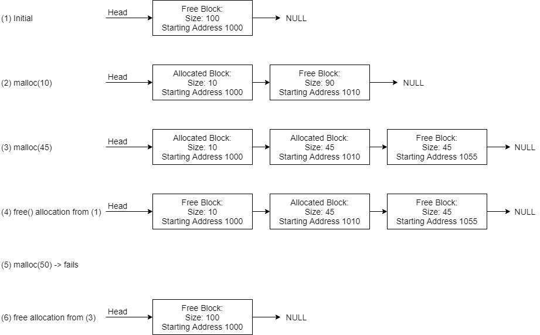

## Introduction

The purpose of this lab is to develop a dynamic memory manager.  This memory manager will replace the functionality of the malloc and free routines built into the operating system.

The heap is considered a contiguous chunk of memory from which storage is allocated using malloc and deallocated using free.  As storage is malloc'ed and freed, memory fragments may appear.  A memory manager needs to keep track of the allocated spaces and fragments in order efficiently satisfy memory requests.  Furthermore, as memory is freed, fragments must be coalesced to ensure optimal memory use.

Your goal for the lab is to implement a memory manager, provide a means for a user to allocate and free memory all while keeping statistics of the memory management system.

## References

Your memory manager will have to mimic the behavior of malloc and free.  It might be helpful to refresh your memory on how malloc and free work.  Furthermore, you will need to ensure synchronized access to the memory manager in the case where a client application is using pthreads.

The following man pages might be helpful for review:
 
- man malloc 
- man free 
- man pthread_mutex_init 
- man pthread_mutex_destroy 
- man pthread_mutex_lock 
- man pthread_mutex_unlock

To view the man pages for the pthread library, they must be installed on your OS image.   You can do that by running the command:

```text
sudo apt-get install manpages-posix manpages-posix-dev
```
## The Exercise

You must implement a set of functions that a program can call to access the memory manager used to allocate and free storage.  In addition, you will need to keep track of allocated and free blocks of memory.

There are several ways this can be done; one way is to use a linked list.  Elements in the list record, the size of the allocated and free blocks and the memory address at the start of the block.  Calls to allocate and free storage modify the list based on the request size.

For example:
1. Consider a heap of 100 bytes that starts at address 1000.  Initially all heap memory is unallocated (free).  So, there is 1 large free block of storage that is 100 bytes long.  The list consists of one element.
2. A call to malloc for 10 bytes modifies the free block to reduce it by 10 bytes and allocates memory to the process.  The free block now has only 90 free bytes.  In addition, an element for the allocated block is added to the list.
3. Another call to malloc, this time for 45 bytes modifies the free block to reduce it by 45 bytes (leaving 45 left).  The list would not have 3 elements: 1 for the first allocated block, 1 for the second allocated block, and one for the free block.
4. A call to free the 10-byte block would convert the allocated block into a free block.  A memory allocation request for 10 bytes or less could be satisfied by that free block.
5. However, a call to malloc 50 bytes at this point would fail because there are no free blocks big enough to satisfy the request.
6. If a call to free is made to free the 45-byte block allocated in step 3, now there are free blocks next to each other.  These should be coalesced (combined) into a single free block

Here's what the list might look like at each step from the example:



Allocating from a free block essentially splits the block into two: One block for the allocated space and one block for the remaining free space.  

NOTE: This splitting is correct except for cases where you have a free block that exactly matches the allocation request.  You should not have any zero sized blocks in your data structure.  If you find a free block that exactly matches the size that you need for an allocation, then there should be no free blocks after it.

As with malloc and free, the caller should not be aware of the mechanism that is being used for memory block record keeping.  Whatever structure you choose to use should be hidden in your memory manager implementation.  This can be done by creating a static structure in your memory manager implementation file.  The internal implementation of the data structure that you use to keep track of blocks is up to you.  Internally to the memory manager, you are free to use malloc and free (the system versions).  This will simulate the overhead that the operating system uses to manage memory.   Just make sure you have no memory leaks within your memory manager.

Normally the size of the heap is controlled using system calls to request modifications to the process address space.  Your memory manager will work a little bit differently.  A user of your memory manager will be required to pass a pointer to a location in memory and a size.  This storage must be pre-allocated by the user.

Your implementation must support 3 different types of placement algorithms to satisfy allocation requests:

1. First fit – allocates from the first free block that is big enough
2. Worst fit – allocates from the largest free block
3. Best fit – allocates from the smallest free block that is large enough to satisfy the request

A summary of all required functions (including statistics functions) is below:

- ```void mmInit(void* start, int size)``` – Initialize the memory manager 
- ```void mmDestroy()``` – cleans up any storage used by the memory manager 
- ```void* mymalloc_ff(int nbytes)``` – Requests a block of memory be allocated using first fit placement algorithm 
- ```void* mymalloc_wf(int nbytes)``` – Requests a block of memory be allocated using worst fit placement algorithm 
- ```void* mymalloc_bf(int nbytes)``` – Requests a block of memory be allocated using best fit placement algorithm 
- ```void myfree(void* ptr)``` – Free the storage address by ptr 
- ```int get_allocated_space()``` – Returns the amount of currently allocated space in bytes 
- ```int get_remaining_space()``` – Returns the amount of current free space in bytes (sum of all free blocks)
- ```int get_fragment_count()``` – Returns the number of free blocks (the count of all the blocks, not the size)
- ```int get_mymalloc_count()``` – Returns the number of successful malloc's made (since the last ```mmInit```)

## Error Checking

Your memory manager can't trust the user so it must perform error checking.  If the user tries to malloc storage that can't be satisfied, return a NULL pointer just like the system malloc.  

Furthermore, if a user tries to free a block that isn't allocated this should cause a segmentation fault.  In this case, your memory manager should send SIGSEGV to the process (see the man page for the kill system call in section 2):

```text
man 2 kill
```
## Getting Started

Start by downloading the [starter files](memory_manager.zip) which includes a source file (memory_manager.c) and a header file (memory_manager.h) that contain a skeleton for the required functions for your memory manager.  The starter code also contains the sample test cases (testmemmgr.c and pthread_testmemmgr.c see below) and a Makefile to help you build your project.

## Sample Usage

Here is a sample client program that uses the memory manager.  This file is provided along with the starter code:

```c
#include <stdio.h>
#include <stdlib.h>
#include <string.h>
#include <unistd.h>

#include "memory_manager.h"

#define MY_HEAP_SIZE 100

int main()
{
    char my_heap[MY_HEAP_SIZE];
    mmInit(my_heap, MY_HEAP_SIZE);
    
    printf("1 -- Available Memory: %d, Fragment Count: %d\n",
        get_remaining_space(), get_fragment_count());

    // Allocate 10 bytes
    //   shouldn't fail
    char* ptr1 = mymalloc_ff(10);
    if(ptr1 == NULL) {
        printf("ptr1 - mymalloc_ff(10) failed\n");
        exit(EXIT_FAILURE);
    }

    strncpy(ptr1, "HELLO", 10);
    printf("ptr1 is %s\n", ptr1);

    printf("2 -- Available Memory: %d, Fragment Count: %d\n", 
        get_remaining_space(), get_fragment_count());

    // Allocate 45 bytes
    //   shouldn't fail
    char* ptr2 = mymalloc_wf(45);
    if(ptr2 == NULL) {
        printf("ptr2 - mymalloc_ff(45) failed\n");
        exit(EXIT_FAILURE);
    }

    strncpy(ptr2, "GOODBYE", 45);
    printf("ptr2 is %s\n", ptr2);

    printf("3 -- Available Memory: %d, Fragment Count: %d\n",
        get_remaining_space(), get_fragment_count());

    // Attempt to allocate 50 bytes
    //   should fail
    char* ptr3 = mymalloc_bf(50);
    if(ptr3 == NULL) {
        printf("ptr3 - mymalloc_bf(50) failed\n");
    }

    printf("4 -- Available Memory: %d, Fragment Count: %d\n",
        get_remaining_space(), get_fragment_count());

    // Free the first two pointers
    myfree(ptr1);
    myfree(ptr2);

    printf("5 -- Available Memory: %d, Fragment Count: %d\n",
        get_remaining_space(), get_fragment_count());

    printf("Total successful mallocs: %d\n", get_mymalloc_count());

    // Double free, should cause a segmentation fault
    myfree(ptr2);

    mmDestroy();

    return 0;
}
```

This should produce the output:

```text
1 -- Available Memory: 100, Fragment Count: 1
ptr1 is HELLO
2 -- Available Memory: 90, Fragment Count: 1
ptr2 is GOODBYE
3 -- Available Memory: 45, Fragment Count: 1
ptr3 - mymalloc_bf(50) failed
4 -- Available Memory: 45, Fragment Count: 1
5 -- Available Memory: 100, Fragment Count: 1
Total successful mallocs: 2
Segmentation fault (core dumped)
```

## Thread Safety

Your memory manager should be thread safe.  In other words, all calls to any memory manager function must work correctly with a multithreaded program.  Race conditions might exist if two threads attempt to allocate or free memory at the same time.  Furthermore, depending on how you implement your statistics, there might be race conditions in those functions as well.  Make sure you use concurrency mechanisms (semaphores, mutex locks, condition variables, etc.) to ensure that your block allocation data structure is never corrupted.

NOTE: you can assume mmInit() and mmDestroy() will only ever be called by a single thread.  Mutual exclusion is not needed for those functions.

A sample test driver using pthreads is included with the starter code.

## Development Tips

- You'll need to come up with an efficient data structure to use.  If you use the system malloc, make sure you don't have memory leaks.  An OS should NEVER have memory leaks.  Don't forget to free your mallocs!
- You need to ensure thread safety so synchronize access to your memory manager. 
- Don't forget about using gdb to help with debugging (compile with -g to get additional debug symbols)

  NOTE: when using gdb it is helpful to compile your program with additional debug symbols included.  These allow gdb to show you more information when running commands like backtrace (bt).  To compile with additional debug symbols use the -g flag on gcc.  For example:

  ```text
  gcc -Wall -g -o myprog mysourcefile1.c mysourcefile2.c mysourcefile3.c
  ```

- Using valgrind will be helpful in this lab to ensure you do not have any memory leaks.
- When compiling your program you will need to include an additional compiler flag: -pthread.  This tells the compiler to use the pthreads library.  The examples use this in the Makefile, so you can see how to use it there as well.  For example:

  ```text
  gcc -Wall -g -o myprog -pthread mysourcefile1.c mysourcefile2.c mysourcefile3.c 
  ```

  NOTE: the -pthread flag can be anywhere on the command line.  It does NOT need to be the last thing on the command line.

## Testing

Use the included test drivers to get you started with testing your lab.  You are also required to create and submit your own test driver(s).  Don't forget to test single threaded and multithreaded programs as well as each of the placement algorithms.  Include your test driver(s) in your submission.  Don't forget to test large and small amounts of memory (both for the managed space and for requests).

## Experimentation

Each of the three placement algorithms have advantages and disadvantages.

- First Fit – Relatively fast for malloc since it stops at the first block that fits the request but could potentially result in more fragments 
- Best Fit – Requires searching through all blocks but attempts to reduce the number of memory fragments by keeping as many larger fragments free as possible 
- Worst Fit – Requires searching through all blocks but attempts to keep the memory fragments as big as possible (on average) to allow more requests to be satisfied.

Despite the advantages and disadvantages, there is no perfect placement algorithm.  It is possible to come with a combination of allocations and frees that cause lots of wasted space.

As part of your lab report, perform some experiments with the different placement algorithms.  Create a series of allocations and frees and report the number of fragments, number of successful allocations along with the total amount of free space.  A placement algorithm is considered 'bad' for a set of allocations and frees if the total amount of free space is large enough to satisfy requests, but the fragments themselves are not big enough to satisfy a contiguous block.