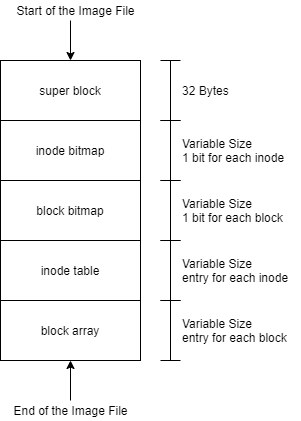
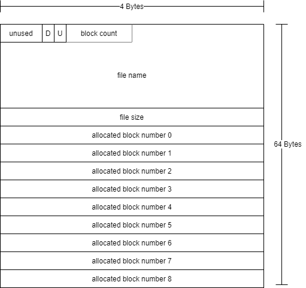
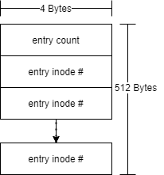

## Introduction and Background

A mass storage device such as a disk drive, solid state drive, or USB "stick" can be considered a large contiguous block of storage like memory.  Like memory, mass storage devices are accessed via an address, however mass storage devices address are for 'blocks' not bytes.  A read from a block device reads the entire block and a write, writes an entire block.  For mass storage devices, a block is typically 512 bytes.  The OS creates an abstraction of 'files' and 'directories' (folder) over the top of mass storage devices to give the user (and applications) the appearance of a file system.  A contemporary operating system such as Linux contains drivers for many file systems, with many being quite complex.

In this lab you will experiment with creating different file systems in Linux as well as interpret a file system architecture for a brand-new file system, teeny tiny file system (TTFS).

In Linux the file system is organized as a tree of files and directories starting at the root directory (/).  The "mount" command allows a system administrator to hang (mount) file systems from a branch of the tree.  Kind of like how you might hang an ornament on a tree during the holidays.  To mount a file system, you first need to create what is known as a "mount point" i.e., an empty directory that will serve as the entry point for the file system.

## Create and Mount a RAM Disk

A RAM disk creates a functional file system directly in random access memory (RAM).  Reads and writes to this file system will be an order of magnitude faster than mass storage device operations.  This fast access speed is a huge advantage.

What are the drawbacks?  1) Size – all file systems are limited based on the size of their backing media.  For a RAM disk that backing media is RAM which is on the order of a few gigabytes.  2) Persistence – When the system is shutdown or rebooted, the data stored in RAM is lost.  For a RAM disk this means that any files stored the file system will also be lost.

Why use a RAM disk then? Temporary files – many applications use short-lived files, either for inter process communication, storing intermediate results, or logging status.  For example, gcc runs through several phases to build an executable program: 1) running the processor, 2) generating assembly, 3) building object code 4) linking the final executable.  The output from each of these phases is one or more temporary files that are ultimately thrown away when the final executable is built.  Storing these intermediate files in a RAM disk may be able to increase compile speeds.  RAM disks are also used during boot to place a minimal system in memory which can then start loading the actual system.

To start, see how much free memory you have.

```text
user@pc:~$ free -h
              total        used        free      shared  buff/cache   available
Mem:           3.9G        263M        3.1G        7.8M        469M        3.4G
Swap:          4.3G          0B        4.3G
```

You should see two rows in the output.  One for physical memory and one for swap (the disk space reserved for the kernel to use for 'kicking out' pages from memory).

For a description of what each field in the table means you can run:  man free

There are two file system drivers that can be used for RAM disks, ramfs and tmpfs.  Large tmpfs disks can actually be swapped out to physical disk, which sort of defeats the purpose, but it is a little more full-featured than ramfs.

Now, make a mount point for the RAM disk.  /media is a common location for mount points.  To do this you will need administrator (root) authority.  The 'sudo' command allows you to temporarily escalate your system privileges to admin.  You'll need to type your password to escalate your privileges.

```text
user@pc:/$ sudo mkdir /media/ramdisk
```

Now we can mount the drive with the mount command and proper options.  The following will create a 512 MB RAM disk with file system type tmpfs in /media/ramdisk.  See man mount for full details.

```text
user@pc:/$ sudo mount -t tmpfs -o size=512m tmpfs /media/ramdisk
```

The disk is now usable.

Because the disk was made transiently, it will not be recreated on a reboot.  This is because Linux does not keep a record of file systems that were mounted when it shuts down.  There is, however, a file that Linux uses determine which file systems to mount at boot up.  This file is the file system table (fstab) and is locate in the /etc directory.  You can have a look opening /etc/fstab or just use the "cat" command to print it out.  You can have a RAM disk be created on every boot by adding an entry to /etc/fstab.  If you do this, the ram disk will be there on every boot, but any files present will be gone.

To complete this activity, perform the following and record your answers to the questions:

1. View the man page for free with "man free".  What does each column mean?  In your own words, what is the difference between free memory and available memory?
2. View the man page for mount with "man mount".  Use the information in the man page to record which file system types your Linux installation supports.
3. Pick one of the file systems supported by our Linux installation and learn more about how it works (use Google to help).  Give a summary of the file system.  Document your resources.
4. Create the RAM disk as outlined above.  What do each of the parameters to "mount" mean?
5. Record the output of free -h after creation of the RAM disk.  What is different?  Why?
6. Based on the observation of the free command before adding the ram disk, and after adding it and adding files to it, in which category of memory does the ram drive appear to reside?
7. Record the status of the RAM disk with the command df -h.  What can you learn about the file system by running df?
8. Copy or download a large file into the RAM disk.  I suggest a large pdf file (maybe around 25M).  Interact with this file (such as opening a pdf with a viewer) in the RAM disk as well as a copy on the normal file system.  What differences do you notice (e.g. performance, etc.)?  Why do you think these difference happen or not?
9. Record the output of free -h and df -h now that the RAM disk has a file in it.  How does the output compare to what you recorded before?  Does the output make sense?  Why?
10. Record the contents /etc/fstab.  What does each entry mean?  Consult "man fstab" for help.
11. What would an entry in /etc/fstab need to look like to create the 512MB tmpfs RAM disk when the system boots?

When done, the drive should be unmounted to tell Linux that it's no longer needed:

```text
user@pc:/media$ sudo umount /media/ramdisk 
```

Remember, that since this is a RAM disk, unmounting the file system will destroy the contents of the file system.

## Mount a File as a File System

Linux represents all block devices as a file in a special file system directory '/dev'.  This directory contains a representation of devices on the system.

List the contents of '/dev' on your Linux VM, you should see several 'files' sdaX (X will be a number).  These represent the disk partitions of the disk on your system.  Partitioning a disk is a way to create logical sub-disks that can each contain a file system that Linux can mount into the directory tree.  The 'file' in '/dev' will contain the binary representation of the file system.

The entire disk (all partitions) is represented by the file '/dev/sda'.  View the partitions created on the disk by running the following:

```text
user@pc:/$ sudo fdisk -l /dev/sda
```

Run the following to view the binary data by reading from the file:

```text
user@pc:/$ sudo hexdump -C /dev/sda1
```

This will print out the contents of the device '/dev/sda1' in hexadecimal.

Run 'mount' (with no arguments) to see all the file systems currently mounted on your Linux VM.  Several of them are RAM disks used for temporary file systems.  You should be able to see where your sdaX partitions are mounted.

While a file system will typically be backed by a physical device represented in '/dev', it doesn't have to be.  A file system can also be created using an ordinary file.  This could be used to create an image to be written to an optical disk or a removable flash drive, or to simply explore file systems without having to install and partition a physical hard drive.

Run the following to create a FAT16 image file:

```text
user@pc:~$ sudo mkdir /media/myimage
user@pc:~$ sudo mkdosfs -C -s 1 -S 512 -F 16 flash.img 5000
mkfs.fat 4.1 (2017-01-24)
```

This will create a file called flash.img which contains the raw bytes for a FAT16 file system with a sector size of 512 bytes and 5000 data blocks (a data block in FAT16 is 1024 bytes).  A disk drive is organized as an array of logical blocks indexed by logical block address (LBA), however this image file is a contiguous array of the bytes that would be placed in the logical blocks if it were to be stored on a disk drive.  On Linux, we can view the file bytes by using hexdump:

```text
hexdump –C flash.img
```

Now mount the image into the Linux directory tree and list its contents by running the following:

```text
user@pc:~$ sudo mount flash.img /media/myimage -o uid=YOURUSERNAME
user@pc:~$ cd /media/myimage/
user@pc:/media/myimage$ ls -al
total 20
drwxr-xr-x 2 root 0 16384 Dec 31  1969 .
drwxr-xr-x 8 root 0  4096 Nov  4 19:21 ..
```

NOTE: replace YOURUSERNAME with the name of your logged-in user.  

Now add some files to the file system image that you mounted.  You can use touch to create an empty file or cp to copy a file into the /media/myimage directory.  While this appears to be just creating or copying files into the directory, since the flash.img is mounted at /media/myimage, the files will be written to the file system image (flash.img) using the FAT16 file system driver.

**Specifically, add four text files, and delete two of them.  Also create at least one file with a long filename (longer than 8 characters).**

Unmount the file system with umount when done.  When you have completed the steps above answer the following questions:

1. Where are the mounted partitions of '/dev/sda' mounted?  Why do suspect that two partitions are used?  What is an advantage of partitioning the disk in this way?
2. Look at the image file with hexdump (hexdump –C flash.img | more).  NOTE: make sure the image is **unmounted** before you do this.  Can you find your files?  How about the ones you deleted?  How did you find them or why couldn't you?
3. Show a capture of the hexdump (of the flash.img) containing the directory entries for the files you added to the image as well as the ones you added and then deleted.  What is different?
4. Remount the image, change directory to the directory where the file system is mounted.  Now try to unmount the file system with "umount /media/myimage".  Did it work successfully?  Why or why not?

## Interpreting a File System - TTFS

Linux supports many file system types.  Each has their own intended use along with advantages and disadvantages.  New file systems are being developed all the time to fit the needs of newer backing storage and application purposes.  In this activity you will be given the format for a new file system (teeny tiny file system – TTFS).  Study the file system format and use the information to interpret a binary file containing a TTFS file system image.

TTFS stores files and directories of varying sizes.  Each file is allocated one or more blocks of data.  An index node (inode) stores information about a file or directory in the file system.  A TTFS file system image is a binary file divided into the following regions:

1. File system super block – contains information about the entire file system
2. inode bitmap – a bit map that indicates which inodes are free and which are used to store file information
3. block bitmap – a bit map that indicates which blocks are free and which hare used to store file data
4. inode table – an array of inodes for files and directories in the file system
5. block array – the array of data blocks for files and directories in the file system

An image for TTFS is laid out like this:



Regions of the file system follow immediately after each other.  The super block contains offset values that can be used to find where regions begin.  Data blocks are 512 bytes long and are accessed via their block index.  The block index is zero based, so the first block is block 0, the second is block 1, etc.

### TTFS Super Block

Each field in the super block is 4 bytes.  The offset numbers indicate where the region begins from the ***start of the file system image***.  Here is a diagram of each of the fields contained in the super block.

<table style="border-collapse:collapse;" border="1">
<thead>
<tr><th>TTFS Super Block</th></tr>
</thead>
<tbody>
<tr><td>TTFS Magic Value</td></tr>
<tr><td>inode count</td></tr>
<tr><td>block count</td></tr>
<tr><td>offset to inode bitmap</td></tr>
<tr><td>offset to block bitmap</td></tr>
<tr><td>offset to inode table</td></tr>
<tr><td>offset to data blocks</td></tr>
<tr><td>unused pads to 32 bytes</td></tr>
</tbody>
</table>

- TTFS Magic Value – an eye-catcher – must contain the string value "TTFS"
- inode count – The total number of index nodes in the file system (used or unused)
- block count – the total number of blocks in the file system (used or not)
- offset to inode bitmap – the offset (in bytes) from the start of the file system image to the start of the inode bitmap
- offset to block bitmap – the offset (in bytes) from the start of the file system image to the start of the block bitmap
- offset to inode table – the offset (in bytes) from the start of the file system image to the start of the inode table
- offset to data blocks – the offset (in bytes) from the start of the file system image to the start of the data block array

The last field "unused" is just a padding to make the super block 64 bytes (makes it easier to read when printed via a hex dump).

To be a valid TTFS file system the image must begin with the characters "TTFS", this is a common way for operating systems to know which driver to load to interpret file a file system. 

The inode count represents the total number of index nodes in the file system.  Each file or directory in the file system needs to have an index node.  This count tells how many files or directories the file system can support.

The block count represents the total number of data blocks that are in the file system.  Each file or directory needs to be allocated at least one block to store data.  This count tells how much space is available in the file system.

The inode and block bitmap are arrays of bit representing which inodes and blocks are used for files, and which are not.  For example, if a file system had 16 inodes and 2 were used for files, then the remaining inodes would be free.  Used inodes are represented with a bit value of 1 and free inodes have a bit value of 0.  So, for this example the inode bitmap would contain 2 bytes (8 bits per byte and 16 inodes requires 2 bytes) and would look like this:

```text
             Byte 0   Byte 1   
     Binary: 00000011 00000000
Hexadecimal: 03       00
```

Notice that the numbers are in little endian.  In other words, the byte ordering goes from low to high from left to the right, but the bit ordering goes from low to high from right to left.

The super block for a TTFS image consisting of 20 inodes and 100 data blocks would look like this in a hexadecimal dump.  NOTE: numbers in an x86 created binary image are little endian.

<pre>
<span style="background:yellow">54 54 46 53</span> <span style="background:lime">14 00 00 00</span>  <span style="background:cyan">64 00 00 00</span> <span style="background:magenta">20 00 00 00</span>  |TTFS....d... ...|
<span style="background:gray">23 00 00 00</span> <span style="background:darkgrey;color:red">30 00 00 00</span>  <span style="background:red">30 05 00 00</span> 00 00 00 00  |#...0...0.......|
</pre>

<code style="background:yellow;color:black">54 54 46 53</code> is the TTFS magic value<br/>
<code style="background:lime;color:black">14 00 00 00</code> is the number of inodes – hex 00 00 00 14 -> 20 in decimal<br/>
<code style="background:cyan;color:black">64 00 00 00</code> is the number of blocks – hex 00 00 00 64 -> 100 in decimal<br/>
<code style="background:magenta;color:black">20 00 00 00</code> is the offset to the inode bitmap – hex 00 00 00 20 -> 32 in decimal<br/>
<code style="background:gray;color:black">23 00 00 00</code> is the offset to the block bitmap – hex 00 00 00 23 -> 35 in decimal<br/>
<code style="background:darkgrey;color:red">30 00 00 00</code> is the offset to the inode table – hex 00 00 00 30 -> 48 in decimal<br/>
<code style="background:red;color:black">30 05 00 00</code> is the offset to the block array – hex 00 00 05 30 -> 1328 in decimal

### TTFS Index Node

An index node contains metadata (data about the data) for a file or directory.  The inode table contains an array of inodes, each inode is 64 bytes long and contains several fields.

The structure of an inode is as follows:



- U – used bit – a single bit that indicates if this inode is used for a file (or directory) or not
- D – directory bit – a single bit that indicates if this inode is for a regular file or a directory
- block count – (1 byte) the total number of data blocks this file is using
- file name – (22 bytes) a string of characters representing the name of the file (null terminated).  The file name in TTFS cannot be longer than 21 characters to make room for the null terminator
- file size – (4 bytes – little endian) represents the total size of the file in bytes.  Block are 512 bytes long and a file might not end exactly at the end of a block
- allocated block table – (up to 9 entries 4 bytes each little endian) represents the block numbers that are allocated to this file.  The block count indicates which entries in this table are valid.  NOTE: Entries in the table indicate the block number for the allocated block number, not an offset in bytes.

The inode for a file consisting of 1 data block, that is using 10 bytes might look like this in a hexadecimal dump:

<pre>
<span style="background:yellow">01</span> <span style="background:lime">01</span> <span style="background:cyan">74 65 73 74 2e 74  78 74</span> 00 00 00 00 00 00  |..test.txt......|
00 00 00 00 00 00 00 00  <span style="background:gray">0a 00 00 00</span> <span style="background:magenta">01 00 00 00</span>  |................|
00 00 00 00 00 00 00 00  00 00 00 00 00 00 00 00  |................|
..... rest of the inode is zeros .....
</pre>

<code style="background:yellow;color:black">01</code> shows the used bit is on but the directory bit is not<br/>
<code style="background:lime;color:black">01</code> indicates the is 1 used block in the file<br/>
<code style="background:cyan;color:black">74 65 73 74 2e 74 78 74</code> is the name of the file - ASCII text "test.txt"<br/>
<code style="background:gray;color:black">0a 00 00 00</code> is the size of the file in bytes – hex 00 00 00 0a -> 10 in decimal<br/>
<code style="background:magenta;color:black">01 00 00 00</code> is the index of the first (and only) data block – hex 00 00 00 01 -> 1 in decimal

### TTFS Directory

Directories (folders) in TTFS are special files.  The inode for a directory has the directory bit flipped to indicate that is a directory and not an ordinary file.  The data blocks for a directory entry to not contain file data.  Instead, they indicate the inodes for the files (or directories) that are contained in the directory.  The structure for a directory entry data block is:



The first 4 bytes indicates an integer number (little endian) of the number of entries contained in the block.  The rest of the data block contains 4-byte integers (little endian) for the inodes for entries (files or directories).

For example, consider a directory 'mydir' that contains two files 'file1.txt' and 'file2.txt'


The inode for 'mydir' (inode 3) would contain a single data block.  The directory data block would look like:

<pre>
<span style="background:yellow">02 00 00 00</span> <span style="background:lime">05 00 00 00</span>  <span style="background:cyan">06 00 00 00 00</span> 00 00 00  |................|
00 00 00 00 00 00 00 00  00 00 00 00 00 00 00 00  |................|
..... rest of the block is zeros .....
</pre>

<code style="background:yellow;color:black">02 00 00 00</code> is the number of files in the block<br/>
<code style="background:lime;color:black">05 00 00 00</code> is the inode number for file1.txt – hex 00 00 00 05 -> 5 in decimal<br/>
<code style="background:cyan;color:black">06 00 00 00</code> is the inode number for file2.txt – hex 00 00 00 06 -> 6 in decimal<br/>

TTFS always contains a single special directory with no name (the file name is all zeros).  This directory represents the root directory of the file system.  All files and directories are contained in the root directory.  The root director will always use inode 0.

NOTE: a TTFS directory might use multiple data blocks.  Each data block has the same structure.  This allows for more than 127 entries in a directory (512 / 4 = 128 but one 4-byte value is used for the entry count).

Download the [ttfs.img](ttfs.img) file.  This contains a binary image for a TTFS file system.  Using the output from hexdump -C and the specification for TTFS answer the following questions:

NOTE: All integers are stored as little endian on x86.  So, make sure you read the values correctly

1. What is the largest file that TTFS can support?  How did you compute this number?
2. What is the maximum number of files that can exist in a single TTFS directory?  HINT: a TTFS directory might have more than one data block.

For the following questions refer to the [ttfs.img](ttfs.img) provided:

5. How may inodes and data blocks are in the file system?
6. How many inodes are free (not used by files or directories?
7. Draw a diagram of the directory hierarchy, include this diagram with your submission.
8. What are the names and sizes of each file in the file system?
9. How many blocks is each file in the file system?
10. For each file, what is the offset (from the start of the file system) for each data block?  How did you compute this?
11. Find one of the text files in the file system.  Write the data (as a string) for the file contents.  How were you able to find the data?

## Extra Credit - TTFS Dump

Using the specification from "Interpreting a File System - TTFS" and the included header file [ttfs.h](ttfs.h) that defines the file system structures, write a program that will read in a TTFS file system image and print the directory structure and contents for each file.  For example:

```text
user@pc:~$ ttfsdump ./ttfstest.img
/file2.txt – 10 bytes
(the contents of file2.txt printed here)
/dir1/file1.txt – 100 bytes
(the contents of file1.txt printed here)
/dir1/dir2/file3.txt – 20 bytes
(the contents of file3.txt printed here)
(continue for all files)
```

Also add the following in your report:

- Design – a description of your design decisions in creating your solution 
- Build – instructions on how to build and run your program.  Include the exact commands that are necessary

Include your source code along with your report in your Canvas submission.

## Deliverables

You will need to include all your source files (if any) and any resources you used to complete lab.  Please don't just google search for a solution, but if you do use Google for any help, include a description and URL of what you used to help you.

Once you've completed all the lab activities and have answers to all the lab questions, create a report (text, doc, or pdf file) including the following:

- Your name, section, date, and lab title 
- Introduction – a description the lab in your own words 
- Resources – a description of any external resources you used to complete the lab 
- Analysis – a description of your experiences working with file systems in Linux as a result of this lab 
  - Include the answers to the questions asked in the lab. 
- Conclusion 
  - Summary of what you learned in the lab 
  - What specifically was challenging about this lab? 
  - What did you like about it? 
  - What could we do to improve it for others?

Be sure to include documentation of any external resources (man pages, stackoverflow, etc.) that you used to complete the lab.

Upload your report to Canvas per your instructor's instructions.

## Grading Criteria

- (5 Points) Report Introduction - Thorough description of the lab in your own words.
- (5 Points) Conclusion - Thorough conclusion with description of what you learned, what you liked, and suggestions for lab improvements.
- (5 Points) Documentation of Resources - Description of external resources used to complete the lab.
- (25 Points) Create and Mount a RAM disk - Responses to the "create a RAM disk" questions
- (25 Points) Mount a File as a File System - Responses to the "file as a file system" questions
- (35 Points) Interpreting a File System - TTFS - Responses to the TTFS interpretation questions
- (10 Points) Bonus - Implementation of the extra credit