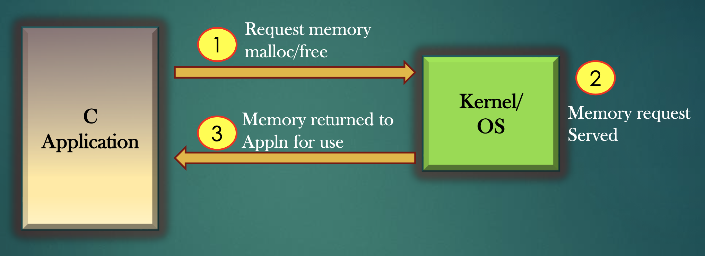
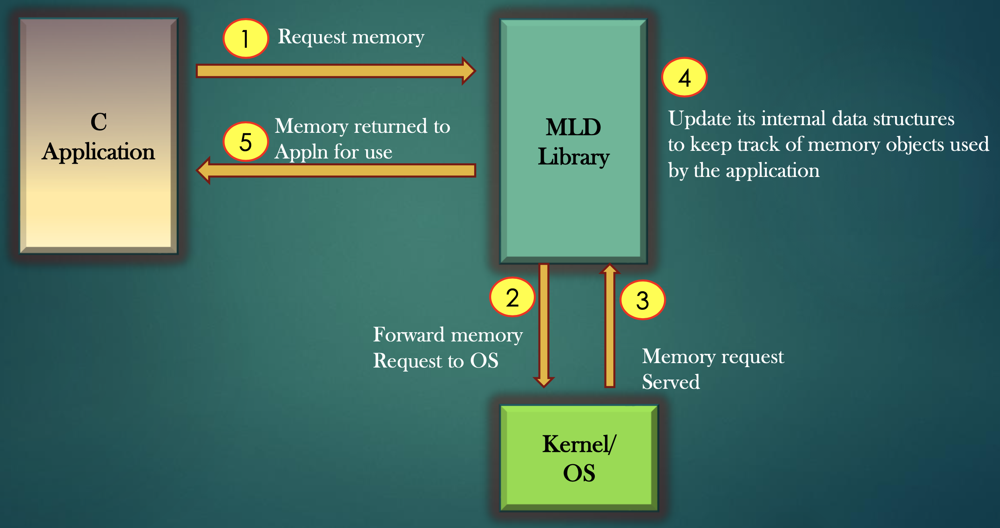

# Final Project Lab - A Garbage Collecctor in C
For your final project you will work in teams of 1-3 students.

Your goal is to develop a library that when inccluded in a program periodically run and cleans up  any heap memory that is no longer neeeded or referenced.

To do so you will need to replace the malloc and free functions in stdio.h such that a in a containing program we only ever call gc_malloc, and never need to call free.

See the image below to see where your library lives

# Requirements
1. You will create the garbage collecting library and show it is working via valgrind
2. You will create a 5-10 min presentation explaining your method, the pro's and con's and any errors
3. You will record said presentation, upload it to youtube, and submit the link
4. You will be present during the final period of our class and answer any questions about your method

# Q&A
1. Can I use internet resources and code for inspiration for my GC?
- Yes
2. Can I copy another library verbatim and say this is my method?
- No
3. Does my garbage collector need to run in parrallel (via threading)?
- No, you can asssume the containing c program will periodically call a clean up function
4. Can I work alone if I want?
- Yes

# Descriptive Images
Images are from the Udemy course [System C Project - Write a Garbage Collector from Scratch](https://www.udemy.com/course/memory-leak-detector/)

